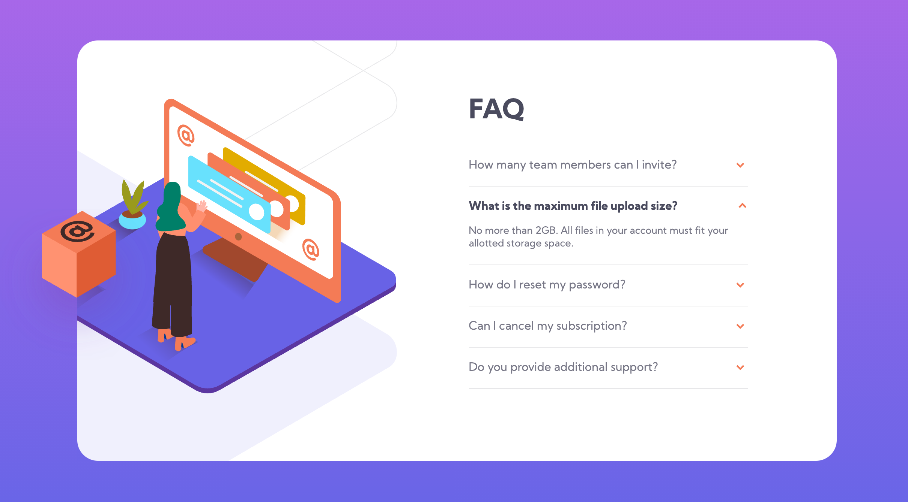
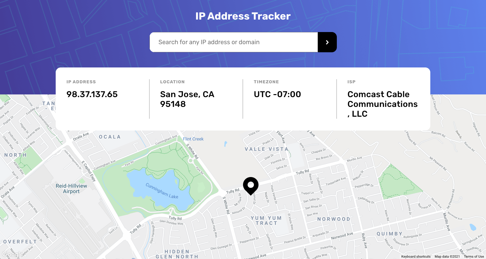

# Frontend Mentor Challenges

## Overview

Solutions to challenges from [Frontend Mentor](https://www.frontendmentor.io/challenges)

## Challenges

  
FAQ accordion card

  The challenge is to build out an FAQ accordion.
  <a href="https://www.frontendmentor.io/challenges/faq-accordion-card-XlyjD0Oam" target="_blank">Visit Frontend Mentor for more info</a>

  

- [Project Details](https://github.com/linhvoyo/fm-challenges/tree/main/fq-accordion-card)
- [Live solution link](https://linhvoyo.github.io/fm-challenges/fq-accordion-card/index.html)

  
IP address tracker

  The challenge is to build out an IP Address Tracker app
  <a href="https://www.frontendmentor.io/challenges/ip-address-tracker-I8-0yYAH0" target="_blank">Visit Frontend Mentor for more info</a>

  

- [Project Details](https://github.com/linhvoyo/fm-challenges/tree/main/ip-address-tracker)
- [Live solution link](https://linhvoyo.github.io/fm-challenges/ip-address-tracker/build/index.html)

