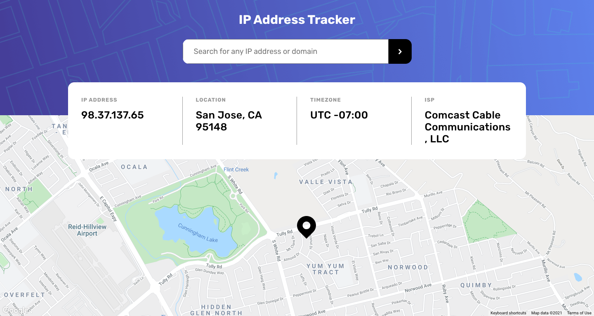

# Frontend Mentor - IP address tracker solution

This is a solution to the [IP address tracker challenge on Frontend Mentor](https://www.frontendmentor.io/challenges/ip-address-tracker-I8-0yYAH0).

## Overview

### The challenge

Users should be able to:

- View the optimal layout for each page depending on their device's screen size
- See hover states for all interactive elements on the page
- See their own IP address on the map on the initial page load
- Search for any IP addresses or domains and see the key information and location

## Built with

- Semantic HTML5 markup
- CSS custom properties
- Flexbox
- [React](https://reactjs.org/) - JS library
- [Google Map React](https://github.com/google-map-react/google-map-react)
- [ip-api](https://ip-api.com/)

Refer to [React-README.md](README-React.md) to start app locally.

### Solution

- Live Site URL: (https://linhvoyo.github.io/fm-challenges/ip-address-tracker/build/index.html)

- Desktop

- Mobile

### Useful resources

- [API Key best practices from Google Developers](https://developers.google.com/maps/api-key-best-practices)
- [Create React App - Deployment](https://create-react-app.dev/docs/deployment/)
